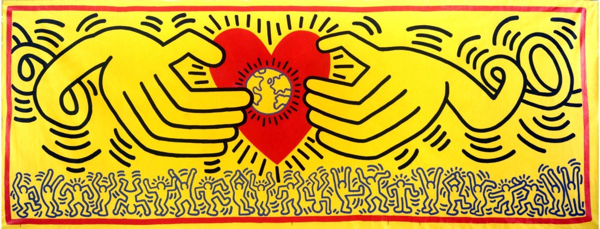

# I love modern `ART`. I am for `PEACE`. I learn `CODING`

## About me

My name is Maria.:wave:  
I was born in Kazakhstan and raised in Russia.:earth_asia:  
I have a degree in engineering business and management.:mortar_board:

My passion is constantly learning new things. Among the things I have studied are stained glass art, interior design, project management, snowboarding, languages, piano, tennis, driving, krava maga and Web development. :tennis:  :musical_keyboard::computer:

Six years ago I moved to Belgium following my husband assignment. The same year I had my daughter. Since then, my time management and stress resistance have improved significantly :smile: :massage:

## My interests

In my free time I like drawing. You can find some of my drawings here:

Watching French films in the original is a real pleasure for me. 
Here are my favorite ones:  

*Le prenom*  
 
